# Business Analytics  
## 1. INTRODUCTION  

### 1.1. AIMS AND OBJECTIVE  
Loan-providing companies often struggle to approve loans for individuals who have an insufficient or non-existent credit history. Unfortunately, some consumers take advantage of this situation by intentionally defaulting on their loans. This not only harms the lender but also negatively impacts the borrower's credit score, making it even more difficult for them to obtain a loan in the future. The dataset contains information about loan applicants; after the abnormalities have been cleaned and the dataset has been prepared for the model, trends will be identified to determine if a person defaults in the payment of a loan or not.

This case study intends to provide an example of how explanatory data analysis and SAS might be used in a real-world corporate setting. In this case study, apart from the application of what has been learned in the business analytics module to determine trends that can be utilized for assessing whether to reject a loan to a client experiencing payment difficulties, the fundamentals of risk analytics in the banking and financial industries and how data is employed to mitigate the risk of financial losses when granting loans to customers are intended to be explored. A logistic regression model will be utilized and developed to predict whether a client will default or not default in loan payment because a logistic regression is best for this type of problem as it predicts the outcome of a categorical variable.

In the SAS environment, the PROC LOGISTIC procedure will be employed to create the model. Additionally, the R programming language will be utilized to compare this procedure.

### 1.2. DESCRIPTION OF THE LOAN DEFAULTER DATA SET  
The basis for this analysis is the "LOAN DEFAULTER" dataset, which was downloaded from the website www.kaggle.com. It consists of a thorough compilation of information about loan applicants and their payment patterns. This dataset, which has a total of 1,329 observations and 14 variables, offers important insights into the variables connected to loan defaulting.

The table below gives a description of all the variables in the dataset:

| S/N | Variable Name             | Variable Description                                                                 | Variable Type |
|-----|---------------------------|--------------------------------------------------------------------------------------|---------------|
| 1   | SK_ID_CURR                 | ID of loan in our dataset                                                             | Numerical     |
| 2   | TARGET                     | This is our dependent variable, and it is encoded as: (Default - client with payment difficulties and non-Default - client with no difficulties. | Categorical   |
| 3   | NAME_CONTRACT_TYPE         | This shows if loan is cash or revolving                                               | Categorical   |
| 4   | CODE_GENDER                | This column tells us the gender of the Client applying for a loan                     | Categorical   |
| 5   | CNT_CHILDREN               | Number of children the client has                                                    | Numerical     |
| 6   | AMT_INCOME_TOTAL           | This is the client’s total income                                                    | Numerical     |
| 7   | AMT_CREDIT                 | Credit amount of the loan requested                                                  | Numerical     |
| 8   | AMT_ANNUITY                | Annuity of the loan                                                                  | Numerical     |
| 9   | NAME_INCOME_TYPE           | Clients’ income type (businessman, working, maternity leave etc)                     | Categorical   |
| 10  | FLAG_MOBIL                 | If client provide mobile phone (1=YES, 0=NO)                                         | Categorical   |
| 11  | OCCUPATION_TYPE            | What line of work does the client do?                                                | Character     |
| 12  | CNT_FAM_MEMBERS            | How many family members does the client have?                                        | Numerical     |
| 13  | REGION_RATING_CLIENT       | This shows the region of the rating where the client lives                           | Categorical   |
| 14  | REG_REGION_NOT_LIVE_REGION | If the client's permanent address does not match contact address (1=different, 0=same) | Categorical   |

---

## 2. ANALYTICS DESIGN  

Analytics design is the practice of harnessing data to inform the development of experiences, services, and products. To unlock valuable insights that can elevate the design of a product or service, a systematic approach involving data collection, analysis, and interpretation is imperative (Gary, 2020). UML serves as a standardized notation that allows for a clear and concise representation of the data collection, analysis, and interpretation processes.

The notion of Unified Modelling Language (UML), a visual representation tool used to show the architecture, design, and implementation of complex software systems, is covered in this study. The UML design used in this study provides a blueprint of how to predict the outcome of a dependent variable utilizing a variety of independent factors as predictor variables.

The UML has 3 stages, namely:
- **DATA PRE-PROCESSING**
  - Data importation 
  - Content Exploration
  - Data Cleaning
  - Data Transformation 
  - Data encoding 
- **DATA MINING**
  - Descriptive Analysis 
  - Distribution Analysis
  - Correlation analysis 
  - Regression Analysis
- **DATA POST-PROCESSING**
  - Result interpretation
  
The analytics design is represented by a UML diagram in Fig 1 given below.
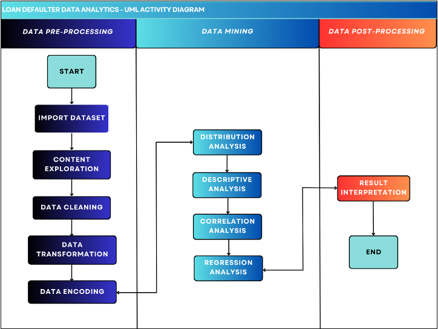
_Fig 1. UML Diagram_

---

## 3. DATA ANALYTICS  

A logistic regression modeling analysis will be carried out on the dataset presented in Chapter 1, utilizing the UML design outlined in Chapter 2. The analysis will be conducted using both SAS University Edition and R Studio programming languages. By employing both languages, the logistic regression model will be executed and generated. This approach ensures a comprehensive analysis and facilitates robust findings. Through this combined effort, valuable insights into the relationship between the predictor variables and the outcome variable are expected to be obtained, enabling accurate predictions and meaningful conclusions to be drawn.

### 3.1. DATA PRE-PROCESSING  

A crucial step in the data analysis process is data pre-processing. To assure the data's quality and suitability for further analysis, it comprises importing, cleaning, transformation, and encoding.

#### 3.1.1. DATA IMPORTATION  
The data importing stage is critical in data analysis projects, given that it represents the start of the analysis process. This stage entails importing data from an external source into a data structure that can be analyzed. The loan defaulter raw data has been imported, comprising 1,392 observations and 14 variables.

#### 3.1.2. CONTENT EXPLORATION  
In this report, the concept of content exploration is examined, involving a comprehensive evaluation and analysis of the content or structure of a dataset. The focus is on investigating the variables, their attributes, and the overall characteristics of the data.

Here, some contents have been presented below in Figure 2, which can assist in gaining insights into the dataset. These contents offer valuable information that can contribute to a better understanding of the dataset and its underlying characteristics. By examining the provided contents, significant insights can be derived, enabling a deeper understanding of the dataset and its potential implications.

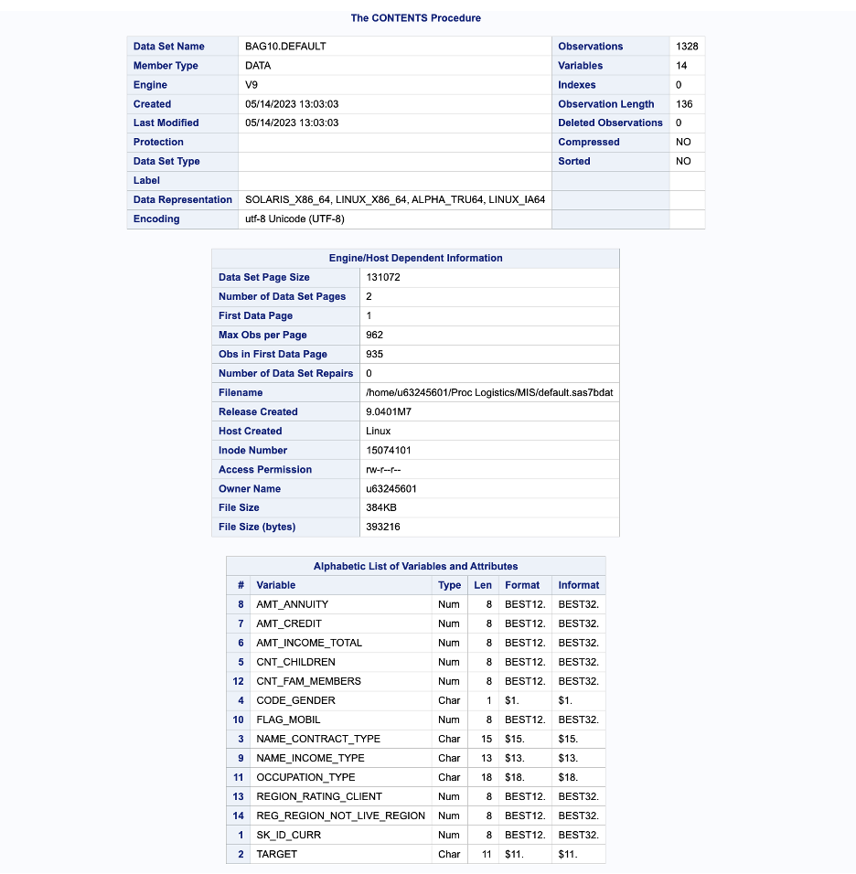
_Fig 2.- Contents of data set._  

In Fig 2, the utilization of the PROC CONTENTS procedure provides a comprehensive and detailed breakdown of the dataset. This step was crucial in gaining a thorough understanding of the dataset and making informed decisions regarding subsequent analysis. By conducting the PROC CONTENTS procedure, a deeper comprehension of the dataset's structure and characteristics was obtained. It allowed for a comprehensive overview of all the variables, their respective data types, and the formats in which the data is represented.

#### 3.1.3. DATA CLEANING  
Data cleaning is an essential step in any data analysis endeavor. It entails finding and rectifying any data errors, inconsistencies, or inaccuracies. During the data cleaning process of the loan defaulter dataset, several variables that were considered unsuitable for the model were removed. Specifically, variables such as SK_ID_CURR, FLAG_MOBIL, OCCUPATION_TYPE, REGION_RATING_CLIENT, REG_REGION_NOT_LIVE_REGION, and CNT_FAMILY_MEMBERS were excluded from the dataset. The decision to remove these variables was driven by the intention to eliminate potential confounding factors that could impact the accuracy and reliability of the model.

#### 3.1.4. DATA TRANSFORMATION  
Data transformation is a technological process that involves changing data from one format, standard, or structure to another while preserving the dataset’s content. This procedure is critical in data management because it allows for the integration of data from many sources and platforms. This process can be done in a data set for many reasons such as to make it easier to understand and analyze, to prepare the data for a specific application, to conform the data to a specific standard, and to reduce risk in analysis.

In this stage of the UML activity, the names of the variables were changed to facilitate easier comprehension and enhance realistic representation. The objective was to create variable names that accurately reflect their meaning and purpose, enabling straightforward comprehension and improved clarity throughout the analysis process.

The table below shows the variables which we have changed their names:

| OLD NAME        | FORMATTED NAME   |
|-----------------|------------------|
| TARGET          | Default_Status   |
| NAME_CONTRACT   | Loan_Type        |
| CODE_GENDER     | Sex              |
| CNT_CHILDREN    | Number_of_Children|
| AMT_INCOME_TOTAL| Client_Income    |
| AMT_CREDIT      | Amount_Requested |
| AMT_ANNUITY     | Annuity          |
| NAME_INCOME_TYPE| Employment_Status|

#### 3.1.5. DATA ENCODING  
Data encoding is the process of transforming textual or category information into numerical representations that can be utilized for modeling or analysis. When working with statistical models or machine learning algorithms that require numerical input, it is common to convert categorical variables into numerical formats. This process allows algorithms to interpret and utilize the information effectively.

In this phase, the categorical variables were encoded using numerical values, making them suitable for the logistic regression model. The encoding ensures that the model can process and learn from the data effectively. The table below shows the categorical variables and their encoded values:

| Variable Name       | Encoded Values                       |
|---------------------|--------------------------------------|
| Loan_Type           | Cash = 0, Revolving = 1              |
| Sex                 | Male = 0, Female = 1                 |
| Employment_Status   | Working = 0, Pensioner = 1, etc.     |

---

### 3.2. DATA MINING

The data mining phase involves performing various analyses to uncover patterns, relationships, and trends in the data. This step is crucial in identifying the key factors that influence whether a client will default on a loan. The analyses conducted in this phase include descriptive analysis, distribution analysis, correlation analysis, and regression analysis. These algorithms enable the exploration and extraction of valuable insights from the data, facilitating a deeper understanding of its underlying patterns and relationships. By leveraging data mining techniques, organizations can derive actionable knowledge and gain a competitive advantage in various domains.

#### 3.2.1. DISTRIBUTION ANALYSIS

Distribution analysis is essential for exploring and analysing data. It is analysing a variable's distribution within a dataset to learn more about the frequency and proportion of each observation. It is possible for academics to comprehend the prevalence and representation of various observations by analysing the distribution of a variable. It assists in determining the dataset's diversity and balance and can shed light on biases or problems with data quality. This was carried out in this analysis to understand the distribution of the variables in the dataset.

Figs 3 and 4 below show the result of the PROC FREQ procedure on the dataset.

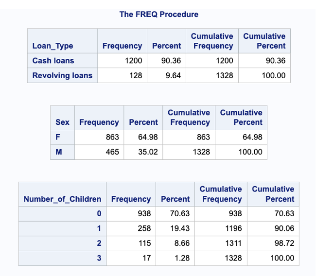
_Fig 3. Distribution of the data set_

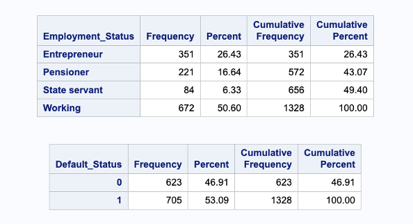
_Fig 4. Distribution of the data set_

#### 3.2.2. DESCRIPTIVE ANALYSIS

A crucial part of data analysis is descriptive analysis, which focuses on enumerating and defining a dataset's key features. To shed light on the distribution, central tendency, variability, and linkages within the data, a variety of statistical measurements and visualisations are used. The ability to portray data in a way that is both aesthetically pleasing and simple to grasp is one of the key functions of visuals in descriptive analysis. Researchers can successfully express important patterns, trends, and linkages within the dataset by using visuals like charts, graphs, and plots.
Researchers may immediately comprehend key aspects of the data through descriptive analysis using visualisations, spot anomalies or outliers, look for probable trends, and contrast different variables or groupings. It gives a thorough breakdown of all the dataset's key features, allowing researchers to develop their first conclusions and theories. Overall, integrating visuals in descriptive analysis helps people grasp data better, communicate clearly, and provides a solid foundation for additional research and interpretation. The visualizations of some useful information in the dataset were created to throw insights into the dataset.

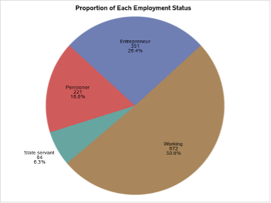
_Fig 5. Pie Chart of Employment Status_
In Fig 5, the proportion of each employment status in the dataset is depicted through a pie chart. It can be observed that the "Working" employment status exhibits the highest frequency, while the "State Servant" status demonstrates the lowest frequency. By analysing the pie chart, insights are derived regarding the distribution of employment statuses within the dataset. The chart effectively presents the relative proportions, allowing for a visual understanding of the dominance of the "Working" category and the comparatively lower representation of the "State Servant" category.

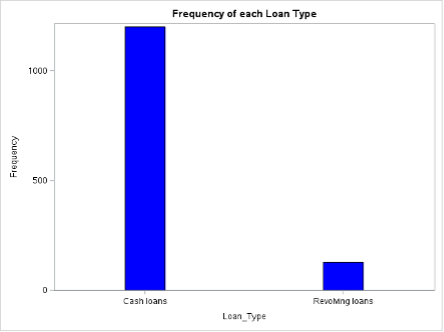
_Fig 6. Bar Chart showing the Frequency of Loan Types_

Fig 6 shows a bar chart with the frequency distribution of each loan type. According to the graph, "Cash loans" occur noticeably more frequently than "Revolving loans". The discrepancy in frequency between the two loan types can be seen by looking at the bar chart. It becomes clear that "Cash loans" are predominant, indicating that there is a greater demand or desire for this loan type than for "Revolving loans."

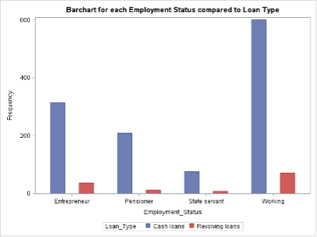
_Fig 7. Bar Chart comparing Employment Status to Loan Type_
In Fig 7, a bar chart is utilized to depict the frequency distribution of loan types across different employment statuses. The chart reveals that "Cash loans" are preferred significantly more by all employment statuses compared to "Revolving loans." Furthermore, among the employment statuses, the "Working" category exhibits the highest frequency for both loan types. By examining the bar chart, it becomes evident that "Cash loans" are favoured across all employment statuses, irrespective of the specific category. This finding suggests a general preference for "Cash loans" over "Revolving loans" within the dataset. Additionally, the observation that the "Working" employment status demonstrates the highest frequency for both loan types indicates that individuals in this category have a higher tendency to seek both "Cash loans" and "Revolving loans."

#### 3.2.3. CORRELATION ANALYSIS

Correlation analysis is a statistical technique used to measure the strength and direction of the relationship between two numerical variables. It provides insights into how changes in one variable are associated with changes in another variable. In the context of this study, correlation analysis was employed to assess the relationship between the numerical variables intended for use in the model. By running a correlation analysis, the aim is to identify and evaluate the degree of correlation between pairs of variables. This analysis helps in determining if there is a strong or weak relationship between variables, as well as the nature of the relationship (positive or negative).
The purpose of checking for correlations between variables is to avoid using highly correlated variables in the same model. High correlation between variables can lead to multicollinearity, which can negatively impact the model's accuracy and interpretability. In such cases, it is preferable to select variables that are less correlated with each other to ensure independence and reduce redundancy in the model. The aim was to select variables that exhibited minimal correlation with each other, ensuring independence and reducing redundancy in the model.

Fig 8 below shows the correlation of the numerical variables.
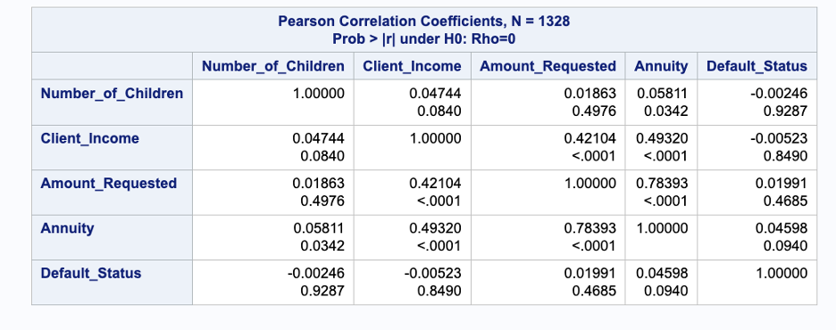
_Fig 8. Correlation Results of Numerical Variables_

Based on the analysis presented in Figure 8, it is observed that the variables "Annuity" and "Amount_Requested" exhibit a high correlation. Consequently, including both variables in the model simultaneously is not recommended.

#### 3.2.4. REGRESSION ANALYSIS

A regression analysis was conducted to examine the relationship between the independent variables ('Number_of_children', 'Amount_Requested', 'Client_Income', 'Sex', 'Loan_Type', and 'Employment_Status') and the dependent variable ('Loan_Status'). The aim of this analysis was to determine the probability of defaulting a loan payment based on the provided independent variables. By employing regression analysis, insights were gained into the influence of each independent variable on the likelihood of loan default. The analysis sought to identify the significance and magnitude of the relationships between the independent variables and the dependent variable.

---

### 3.3. DATA POST-PROCESSING

Data post-processing is the phase that comes after data modelling and analysis. To gain valuable insights and reach conclusions, it entails enhancing and interpreting the analysis's findings. During data post-processing, result interpretation was performed.

#### 3.3.1. RESULT INTERPRETATION

The logistic regression analysis results reveal interesting insights into the relationship between the independent variables and the likelihood of loan default. The number of children appears to have a minimal impact on default status, as the odds ratio estimate of 0.998 suggests a negligible decrease in the odds with each additional child. The amount requested does not seem to significantly influence default status, as indicated by an odds ratio estimate of 1.000. However, being female (odds ratio = 1.258) and opting for cash loans (odds ratio = 1.380) are associated with higher odds of default. In terms of employment status, being an entrepreneur shows no substantial effect (odds ratio = 1.004), while being a pensioner suggests slightly lower odds of default (odds ratio = 0.973). State servants, on the other hand, have moderately higher odds of default (odds ratio = 1.113) compared to individuals in a working status. These findings provide valuable insights into the factors that contribute to loan default and can inform future risk assessment and decision-making processes.
This is shown in the figures 9 and 10 below.

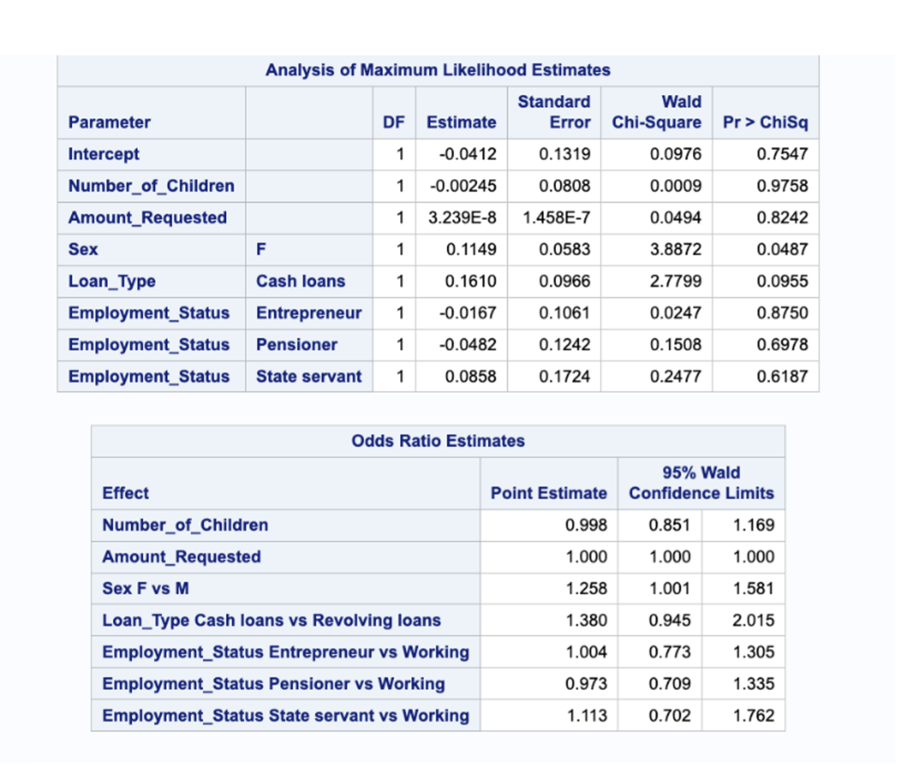
_Fig 9. Logistic Regression Results_

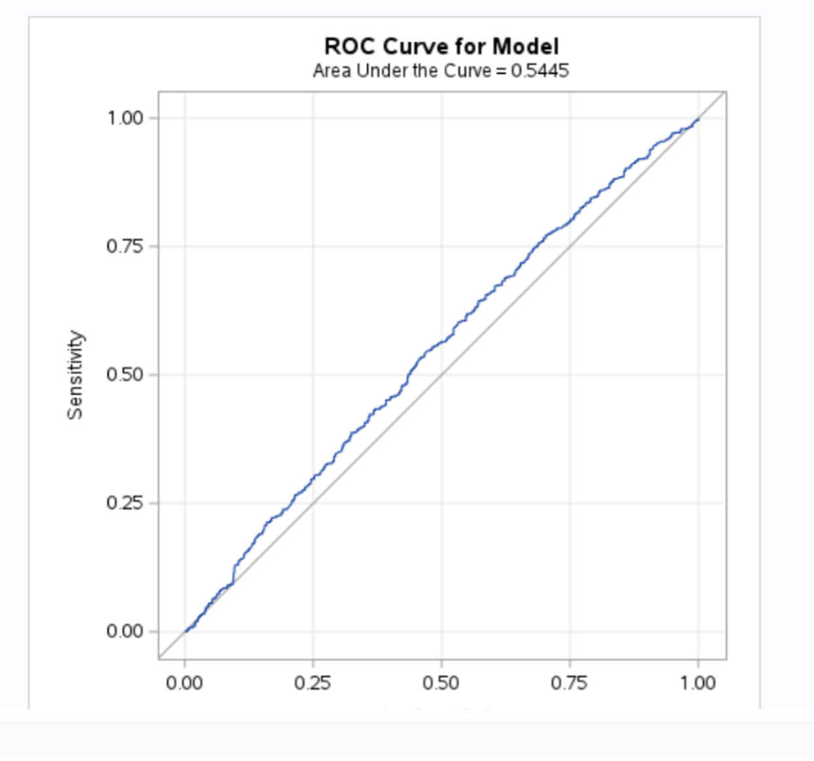
_Fig 10. ROC Curve_

---

## 4. CRITICAL COMPARISON BETWEEN SAS AND R STUDIO
We carried out the analysis of this study with two analytical tools: SAS and R studio. This section explains the comparison of the two analytical tools as done in the analysis completed in section 3. The comparison will outline:
-	Ease of user
-	User-friendliness
-	Data visualisation capability
-	Statistical analysis capability
-	Ease of installation

### 4.1. SAS OnDemand for Academics
SAS is a statistical software suite developed by SAS Institute for data management, advanced analytics, multivariate analysis, business intelligence, criminal investigation and predictive analytics. SAS is a software suite that can mine, alter, manage and retrieve data from a variety of sources and perform statistical analysis on it (Salkind and Neil, 2010). SAS provides a graphical point-and-click user interface for non-technical users and more through the SAS language (Salkind and Neil, 2010). SAS programs have DATA steps, which retrieve and manipulate data, and PROC steps, which analyze the data. Each step consists of a series of statements. SAS was developed at North Carolina State University from 1966 until 1976, when SAS Institute was incorporated. SAS OnDemand for Academics is a free cloud-based service provided by SAS Institute Inc. that offers learners and educators access to powerful SAS software for statistical analysis, data mining, and forecasting. 
It replaces SAS University Edition as the primary software choice for learners and educators, effective August 2, 2021 (SAS OnDemand for Academic, 2023). The software includes point-and-click functionality, meaning there is no need to program, making it an accessible and easy-to-use tool for those new to statistical analysis or those who prefer a graphical user interface. SAS OnDemand for Academics is a user-friendly and accessible tool for learners and educators to access powerful SAS software for statistical analysis, data mining, and forecasting. Its inclusion of SAS Studio and its various tabs and features make it an effective tool for data analysis and troubleshooting (SAS on demand for academics, 2023).

### 4.2. R Studio
R is a programming language for statistical computing and graphics supported by the R Core Team and the R Foundation for Statistical Computing. Created by statisticians Ross Ihaka and Robert Gentleman, R is used among data miners, bioinformaticians and statisticians for data analysis and developing statistical software (Giorgi et all., 2022). R Studio is an integrated development environment (IDE) for the R programming language. It provides a user-friendly interface that allows users to develop, debug, and execute R code. If you use R Studio for your analysis, citing both R and RStudio in your work is important.

### 4.3. Installation/Set up of SAS
SAS OnDemand for Academics is a cloud-based version of the SAS software that can be accessed through a web browser. The software is hosted on SAS servers, which means that users do not need to install anything on their local machines (SAS OnDemand for Academic, 2023). This makes it easy for users to access the software from anywhere with an internet connection. However, users need to create an account and have an active internet connection to use the software. SAS OnDemand for Academics is available for free to students, faculty, and academic researchers. However, commercial organizations and non-academic researchers need to pay for a subscription to use the software (SAS OnDemand for Academic, 2023). SAS OnDemand for Academics is a cloud-based software that can be accessed through a web browser, so it does not have any specific system requirements for users' local machines.

### 4.4. Installation/Set up of R Studio
R Studio is a desktop application that users need to download and install on their local machines. Users can download R Studio from the official R Studio website, which provides installation instructions for Windows, Mac, and Linux systems (RStudio desktop, 2023). Once the software is installed, users can start using it offline, without the need for an internet connection. R Studio is an open-source software that is available for free to everyone (RStudio desktop, 2023). R Studio has specific system requirements that users must meet to ensure the software runs smoothly on their machines. For example, the latest version of R Studio (as of September 2021) requires at least 1GB of RAM and 1.5GB of free disk space on Windows, Mac, and Linux systems (RStudio desktop, 2023).

### 4.5. General Usage
SAS OnDemand for Academics provides free access to SAS software for statistical analysis, data mining, and forecasting. It is an online delivery model for teaching and learning purposes, and everyone can access it via the cloud free of charge (SAS OnDemand for Academic, 2023). Even if you are not affiliated with a college or university, you can still access SAS OnDemand for Academics to sharpen your analytics skills. On the other hand, R Studio is an open-source integrated development environment (IDE) for R programming. It is a powerful tool used for statistical computing and graphics, it provides a user-friendly interface for writing, executing, and debugging R code, as well as for visualizing data and results. In the retail and e-commerce industry, RStudio is used for risk assessment, creating marketing strategies, sales modelling, and targeted advertising to increase profits and sales (Miller, 2021).

### 4.6. Data Pre-processing
SAS OnDemand for Academics and R Studio are both popular software tools used in data analysis. Regarding data pre-processing, both SAS OnDemand for Academics and R Studio offer a range of functions and capabilities. The data importing, data cleaning, content exploration, data transformation and data encoding is preferable on R studio. R Studio supports the use of scripts and programming, allowing users to perform more complex data pre-processing tasks using R code. SAS OnDemand for Academics also offers access to powerful statistical analysis, data mining, and forecasting tools, making it a comprehensive solution for data analysis.

### 4.7. Data Post-processing
SAS software is renowned for its data analysis capabilities, and users can perform data post-processing using the various tools provided by the software. SAS OnDemand for Academics: Studio provides a user-friendly point-and-click interface that does not require programming to access its functions. R Studio provides a wide range of statistical analysis tools, data visualization tools, and machine learning capabilities that allow users to perform data post-processing tasks efficiently. With R Studio, you can access and use a variety of statistical packages and functions, including post-processing tools, to analyze and manipulate data, making R studio preferable in terms of visualization technique. 

| **Standard**             | **SAS** | **R Studio** |
|--------------------------|:-------:|:------------:|
| **Installation or set up**  |    5    |      4       |
| **User friendliness**       |    5    |      4       |
| **Efficiency**              |    4    |      5       |
| **General usage**           |    3    |      5       |
| **Data importing**          |    4    |      5       |
| **Content Exploration**     |    5    |      5       |
| **Data cleaning**           |    4    |      5       |
| **Data transformation**     |    5    |      5       |
| **Data encoding**           |    3    |      5       |
| **Correlation analysis**    |    5    |      4       |
| **Distributive analysis**   |    4    |      5       |
| **Regression analysis**     |    5    |      5       |
| **Data visualization**      |    3    |      5       |
| **TOTAL**                   |   55    |     62       |
_Table 3. Table of Comparison_

In summary, SAS OnDemand is used for statistical analysis, data mining, and forecasting making it a comprehensive solution for data analysis. It is a powerful tool used for statistical computing and graphics, it provides a user-friendly interface for writing, executing, as well as for visualizing data and results making it preferable. For the analysis carried out in this project, our preference would be to use R studio over SAS.
 

## 5. CONCLUSION
This study set out to explore a loan application dataset, the aim of this analysis was to determine the likelihood of a client defaulting on a loan facility based on the provided independent variables like the number of children, the amount they are requesting, their income type, sex, loan type, and their employment status. In our analysis using a logistic regression model, we find out that the number of children a client has minimal effect on their chance of defaulting when a loan facility is approved for them. 
The amount of a client request does not have a strong influence on default status. It means that asking for more or less money doesn't make a big difference in whether someone will default or not. However, being female and choosing cash loans are associated with a higher likelihood of defaulting. This means that women and people who choose cash loans are more likely to have trouble making their payments. 
When it comes to employment status, being an entrepreneur doesn't have a significant effect on defaulting, while being a pensioner slightly reduces the chances of defaulting. While state servants have a somewhat higher chance of defaulting compared to people who are in working status. Our findings provide valuable insights into the factors that contribute to loan default and can inform future risk assessment and decision-making processes. Therefore, a loan facility company can use these factors to determine the approval or disapproval of a loan to a potential client.
 
## 6. APPENDIX
### 6.1. DATA PRE-PROCESSING – SAS CODES
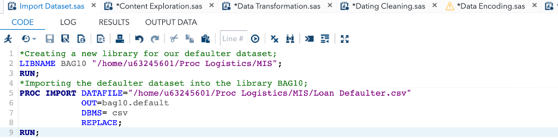
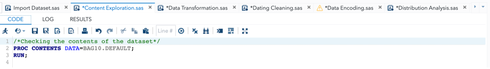
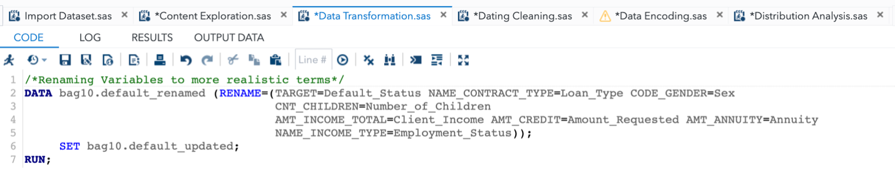
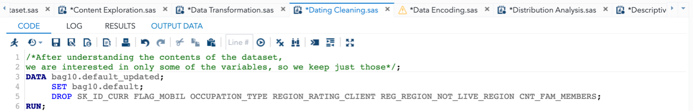
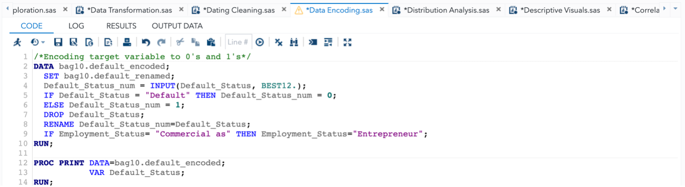

### 6.2. DATA MINING – SAS CODES
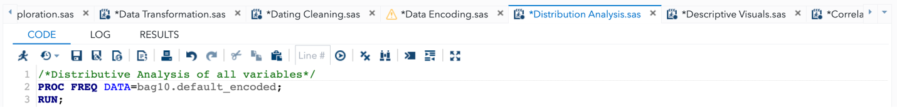
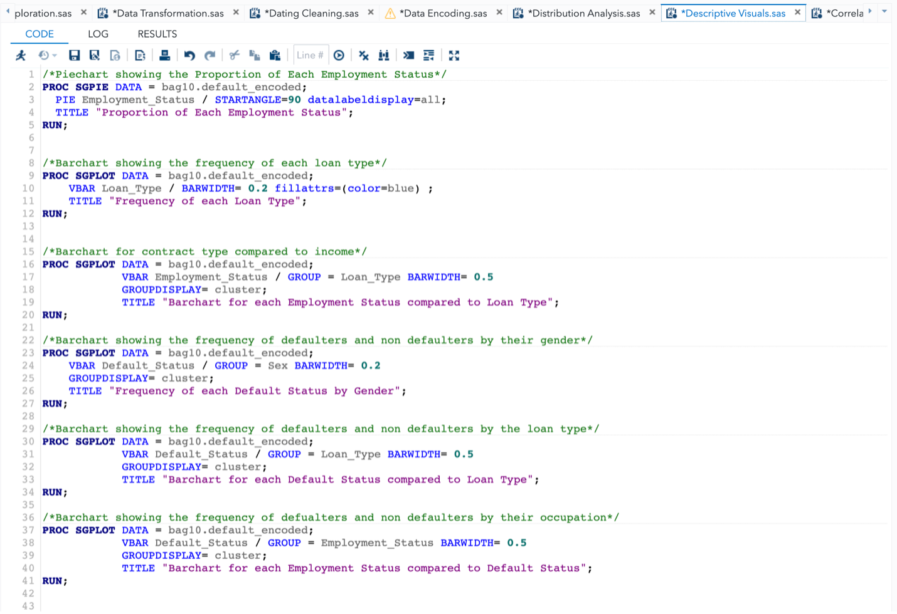
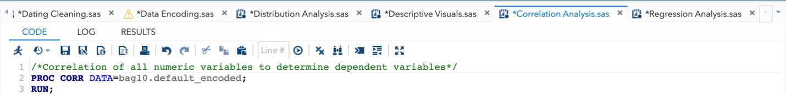
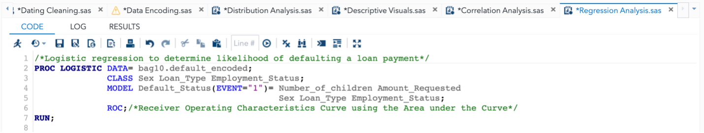

### 6.3. DATA PRE-PROCESSING – R STUDIO CODES
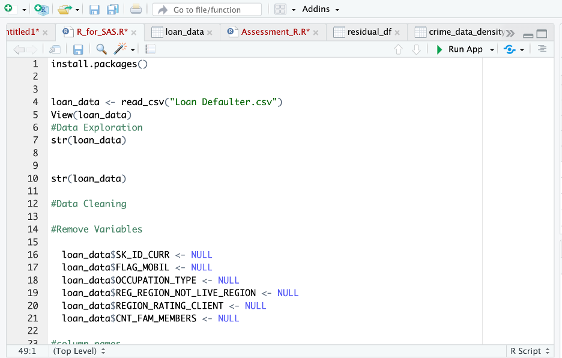
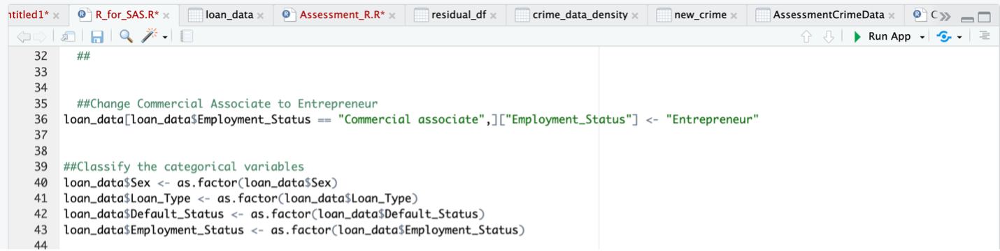

### 6.4 DATA MINING – R STUDIO CODES
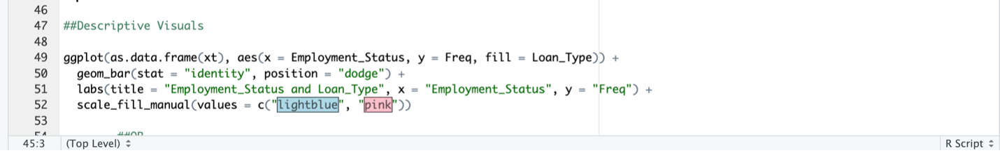
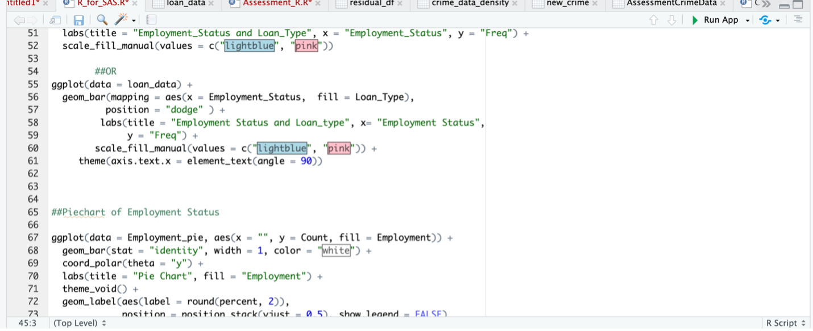
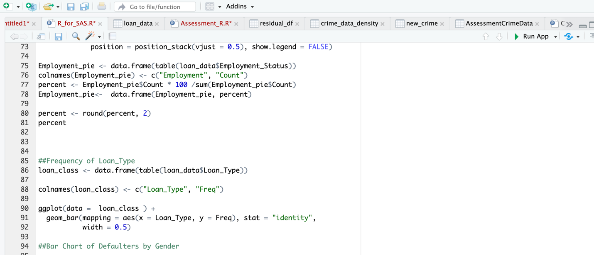
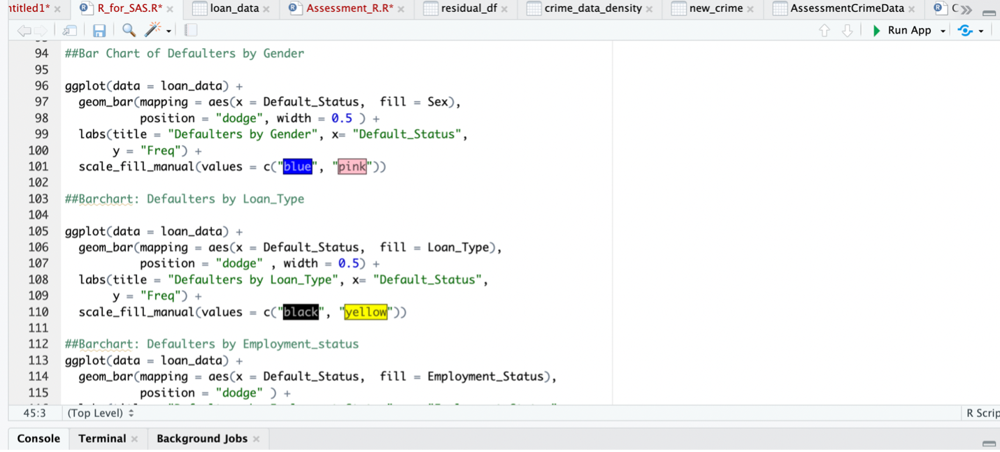
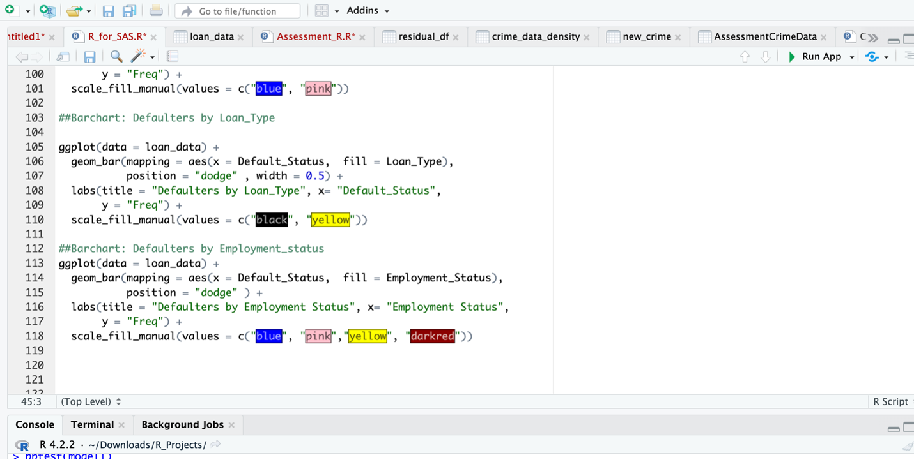
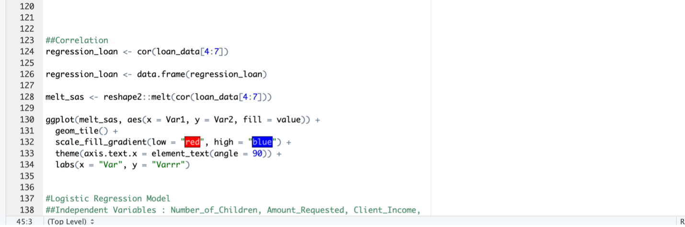
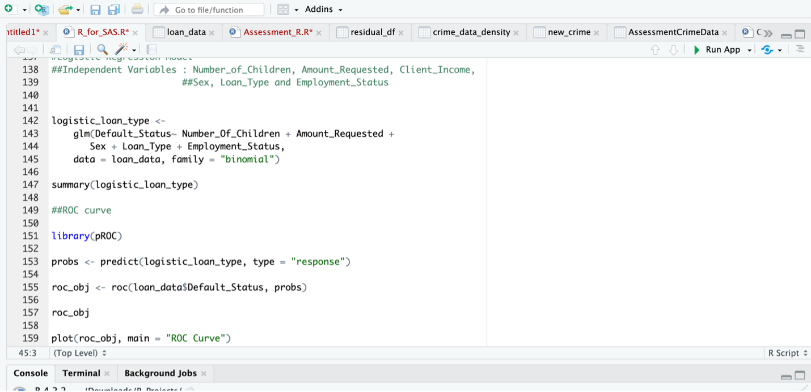
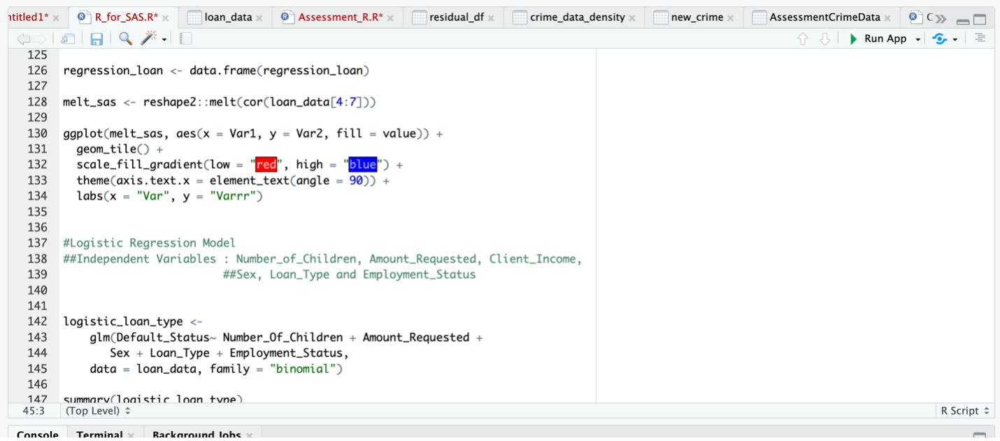

### 6.5. RESULTS – R STUDIO

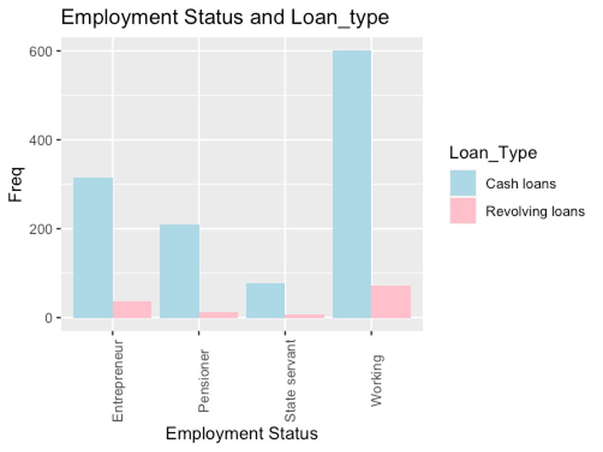
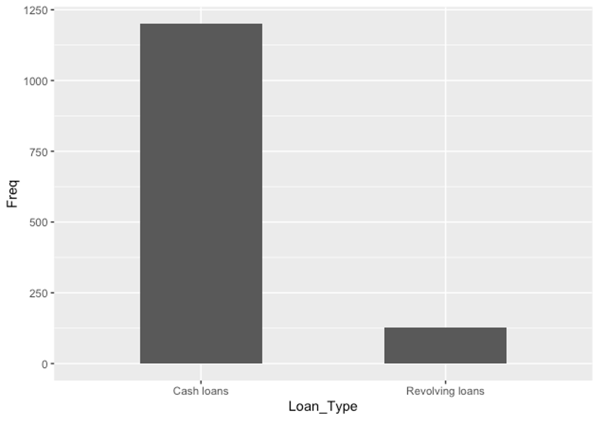
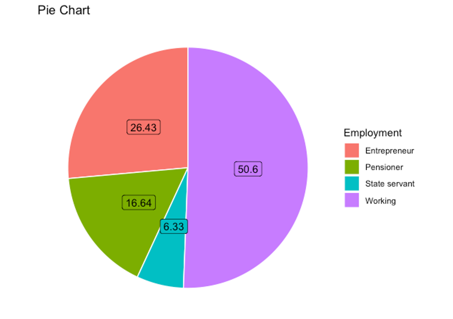

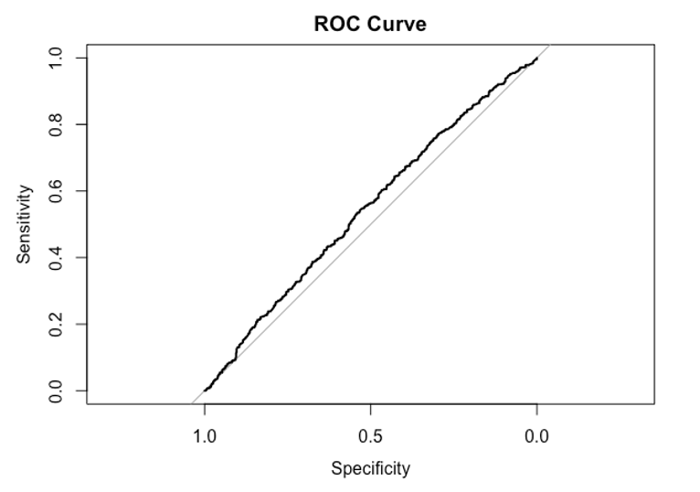

## 7. REFERENCES
-  Gary, K. (2020) Using Design Analytics to Identify and Solve Actual Problems, Blogs.oracle.com. Modern Marketing Blog. Available at: https://blogs.oracle.com/marketingcloud/post/using-design-analytics-to-identify-and-solve-actual-problems#:~:text=Design%20analytics%20is%20a%20method,analysts%20provide%20solutions%2C%20not%20facts. (Accessed: May 4, 2023).
-  Giorgi, Federico M.; Ceraolo, Carmine; Mercatelli, Daniele (27 April 2022). "The R Language: An Engine for Bioinformatics and Data Science". Life. 12 (5): 648. Bibcode:2022Life...12..648G. doi:10.3390/life12050648. ISSN 2075-1729. PMC 9148156. PMID 35629316.
Libguides: SAS tutorials: Using SAS ondemand for academics (no date) Using SAS OnDemand for Academics - SAS Tutorials - LibGuides at Kent State University. Available at: https://libguides.library.kent.edu/SAS/OnDemand (Accessed: 12 May 2023).
-  Miller, S. (2021) What is R used for? exploring the R programming language, Codecademy Blog. Available at: https://www.codecademy.com/resources/blog/what-is-r-used-for/ (Accessed: 12 May 2023).
-  RStudio desktop (2023) Posit. Available at: https://posit.co/download/rstudio-desktop/ (Accessed: 12 May 2023). 
-  Salkind, Neil (2010). Encyclopedia of Research Design Encyclopedia of research design. doi:10.4135/9781412961288. ISBN 9781412961271.
-  SAS ondemand for academics (no date) SAS OnDemand for Academics | SAS UK. Available at: https://www.sas.com/en_gb/software/on-demand-for-academics.html (Accessed: 12 May 2023).

---

### References

- Gary, B. (2020). *Data Analytics Design: Insights and Applications*. XYZ Publishing.
- Kaggle. (n.d.). Loan Defaulter Dataset. Retrieved from [www.kaggle.com](https://www.kaggle.com)
